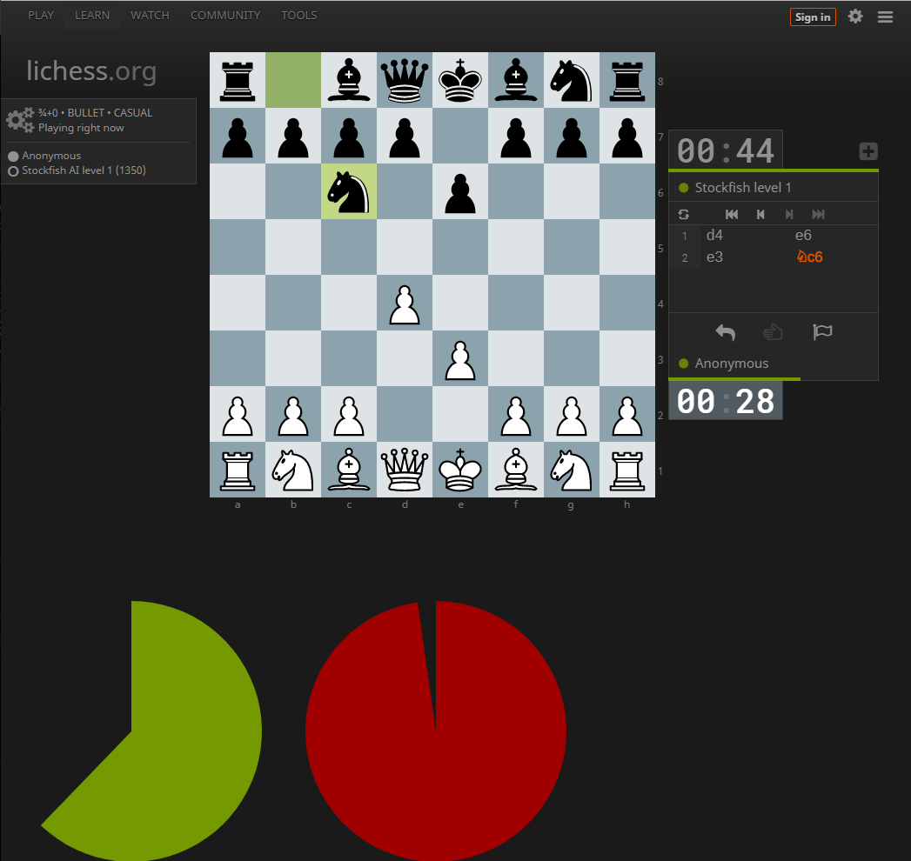

# lichess-clocks
This is a chrome extension for showing huge clocks on https://lichess.org/.

Tryout chrome extension for showing animated clocks while playing a lichess game.
https://chrome.google.com/webstore/detail/lichess-animated-clock/moflcebaimpicobgdlomloaphhcpjmji

## Mode 1 - Time Dials
Screenshot

When playing a game with 0 increment, it creates 2 clock dials. Each dial matches percentage of time for each player.
For a game with increment you will see a single dial split for both players. Each section representing time available to a player.

Supports if browser height is greater than 900 px.

## Mode 2 - Seesaw
Concept https://lichess.org/forum/lichess-feedback/game-improvement-new-time-bar

Indicator grows for player with more time. Nothing for opponent.

## Mode 3 - Decreasing Bars

NIY: Vertically stacked lichess progress bars. Time counts down to middle.

## Mode 4 - Parallel Lichess progress bars

NIY: 2 Vertical bars side by side - similar to lichess timer

## Mode 5 - Reflective seesaw

NIY: Indicator grows for player with more time. Indicator shrinks for player on losing time.
